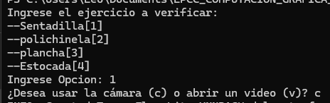
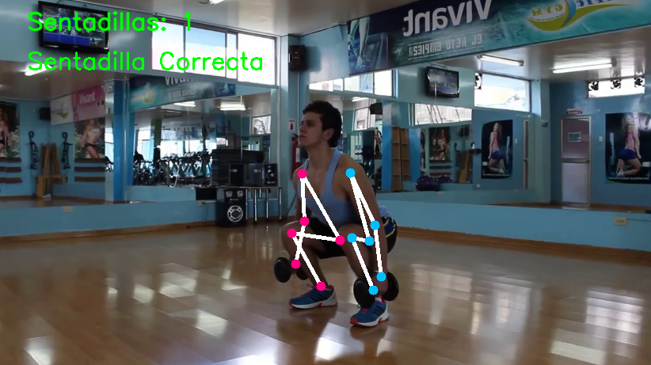

# LABORATORIO-04-GRUPAL
Repositorio del trabajo grupal con CV2 en Python
## Descripcion
Este proyecto reconoce los movimientos de una persona e indica si esta realizando los ejercicios adecuadamente. Actualmente funciona para planchas, polichinelas, sentadillas y estocadas. Soporta videos y entrada en vivo.
## Integrantes:
- Leonardo Montoya Choque
- Manuel Angel Nifla Llallacachi
## Requerimientos:
Para poder ejecutar el programa, necesitamos de OpenCV, MediaPipe y Numpy.
    
    pip install opencv-python numpy mediapipe

## Ejecucion:
Solo se debe de ejecutar main.py
    
    python main.py

## Funcionamiento
Tras ejecutar el programa, se abrira un menu contextual en el que se podra seleccionar el tipo de ejercicio con el que se trabajara, asi como el tipo de entrada que se desea usar. En caso ser un video, se debera especificar la ruta del mismo.  
  
Tras lo que se iniciara el programa con el tipo de entrada seleccionado.  
  
Se puede detener la ejecucion del programa en cualquier momento presionando 'q'.